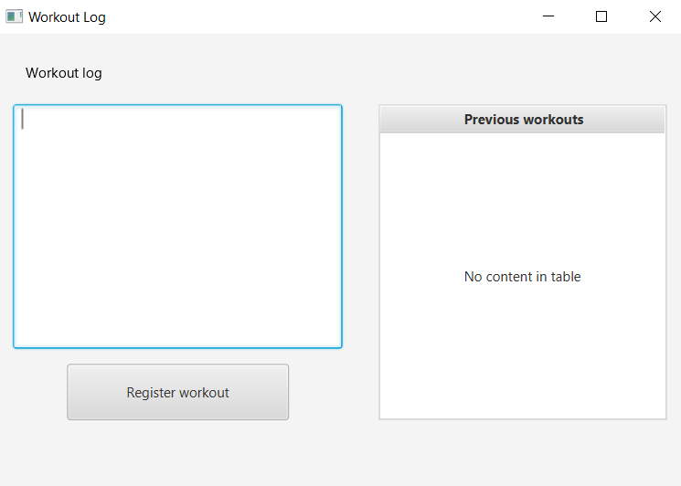

# App description and user stories

## App description

This application functions as a workout diary. The purpose is for the users to be able to log and keep track of their workout sessions to easily find them again later.

To keep track of requirements and priorities when developing the app, we have user stories. These describe the key functionalities our app should have and why they are important.

## Workout log (us-1)

As a health and fitness interested person, I want to keep track of my workouts so that I can repeat the excercises later without worrying about remembering past sessions.

The user wants a place to save completed workout excercises to make it easy to find them again later. The excercises should be added to a file by entering the details into a text field and clicking an "Add" button. All the excercises should end up in the same file and displayed on screen after they are registered so that the user can easily view their workout history.

### Important to be able to see

- When working out: a text field to write excercises into and a button to register them
- After working out: history of previous excercises displayed on screen

### Important to be able to do
  
- Add new excercises

### Screenshot

*Figure 1: Screenshot of the UI*

The screenshot shows the input field with the "Add" button underneath and a display area where the workout history will appear when excercises are registered.

## Date log (us-2)

As a health and fitness interested person who keeps a log of my workouts, I want to be able to go back in time and look at my previous workouts so that I can se my improvement.

The user need to connect each workout to a date to make it easier for the user to go back in time and see their workout at a certain date. This should be added as a date field above the input field. The log should also be sorted in order by date.

### Important to be able to see

- The date input field to register date
- The workout log displaying date sorted in order

### Important to be able to do
  
- Add date to the excercises
- Sort workout log in date order

### Screenshot

*Figure 1: Screenshot of the UI*

The screenshot shows the date input field

## Add Changes (us-3)

As a person that logs my workouts, I want to be able to edit earlier registered workouts, so that I can correct mistakes and add important information.

The user wants a place to save completed workout excercises to make it easy to find them again later. The excercises should be added to a file by entering the details into a text field and clicking an "Add" button. All the excercises should end up in the same file and displayed on screen after they are registered so that the user can easily view their workout history.

### Important to be able to see

- When working out: a text field to write excercises into and a button to register them
- After working out: history of previous excercises displayed on screen

### Important to be able to do
  
- Add new excercises

### Screenshot

*Figure 1: Screenshot of the UI*

The screenshot shows the input field with the "Add" button underneath and a display area where the workout history will appear when excercises are registered.

## Delete and Clear input (us-4)

As a health and fitness interested person, I want to keep track of my workouts so that I can repeat the excercises later without worrying about remembering past sessions.

The user wants a place to save completed workout excercises to make it easy to find them again later. The excercises should be added to a file by entering the details into a text field and clicking an "Add" button. All the excercises should end up in the same file and displayed on screen after they are registered so that the user can easily view their workout history.

### Important to be able to see

- When working out: a text field to write excercises into and a button to register them
- After working out: history of previous excercises displayed on screen

### Important to be able to do
  
- Add new excercises

### Screenshot

*Figure 1: Screenshot of the UI*

The screenshot shows the input field with the "Add" button underneath and a display area where the workout history will appear when excercises are registered.